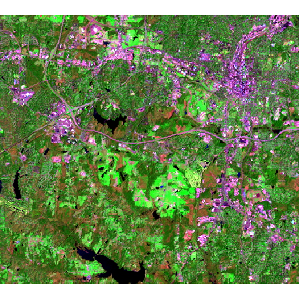

# Example using GRASS GIS command line

Here we are going to use the GRASS GIS sample North Carolina data set as a basis to perform a landsat classification. We are going to classify a Landsat 7 scene from 2000, using training information from an older (1996) land cover dataset.

Note that this example must be run in the "landsat" mapset of the North Carolina sample data set location.

Plot a landsat 7 (2000) bands 7,4,2 color composite:

```
i.colors.enhance red=lsat7_2000_70 green=lsat7_2000_50 blue=lsat7_2000_20
d.rgb red=lsat7_2000_70 green=lsat7_2000_50 blue=lsat7_2000_20
```



Generate some training pixels from an older (1996) land cover classification:

```
g.region raster=landclass96 -p
r.random input=landclass96 npoints=1000 raster=training_pixels
```

<p>Then we can use these training pixels to perform a classification on the more recently obtained landsat 7 image:</p>

```
r.learn.train group=lsat7_2000 training_map=training_pixels \
	model_name=RandomForestClassifier n_estimators=500 save_model=rf_model.gz

r.learn.predict group=lsat7_2000 load_model=rf_model.gz output=rf_classification
```

Now display the results:

```
# copy color scheme from landclass training map to result
r.colors rf_classification raster=training_pixels

# plot the results
d.rast rf_classification
```


